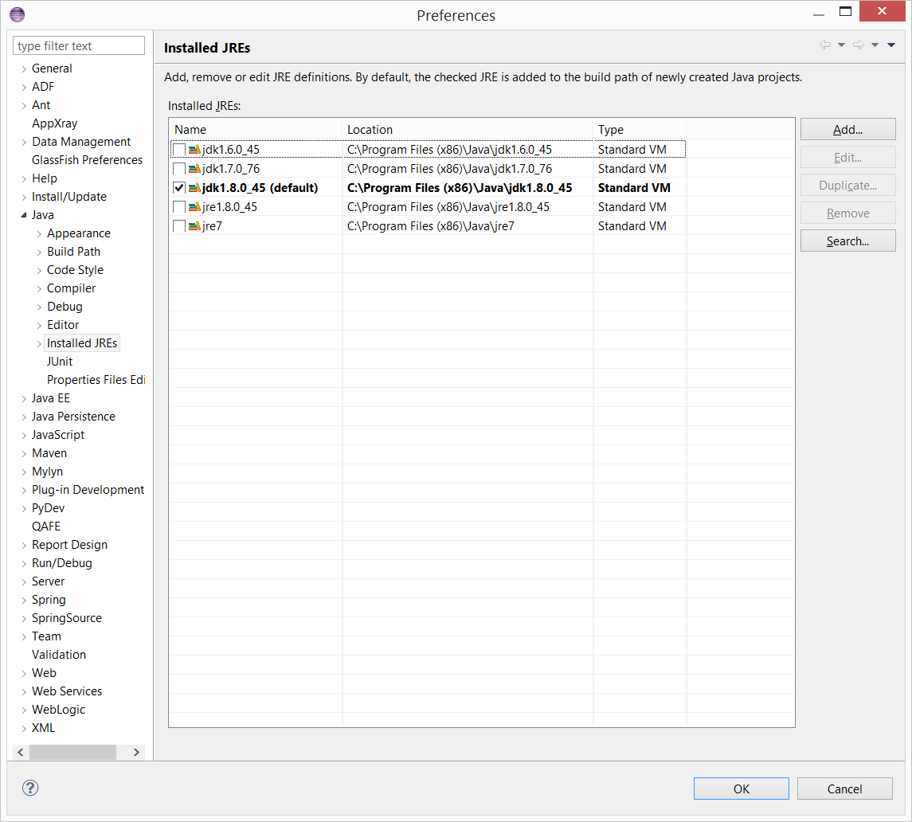

# Troubleshooting Maven Build Failure

When building your QAFE project, chances are you run into a 'Build Failure'. Unfortunately there are lots of reasons why this can happen. The most common reasons for a 'Build Failure' are:
- Bugs in source code
- Incorrect configuration
- Wrong Maven version
- Maven Dependency Conflicts

If you get a 'Build Failure' and none of the above reasons apply, the contents of this page might provide a solution.

## Not using a correct JDK

Using a wrong JDK/JRE could result in a 'Build Failure'.

### Symptoms

The console output after the Maven build shows something similar to the following:

```
[INFO] --- maven-compiler-plugin:3.0:compile (default-compile) @ SomeProject ---
[INFO] Changes detected - recompiling the module!
[INFO] Compiling 1 source file to D:\Projects\SomeProject\target\classes
[INFO] -------------------------------------------------------------
[ERROR] COMPILATION ERROR : 
[INFO] -------------------------------------------------------------
[ERROR] No compiler is provided in this environment. Perhaps you are running on a JRE rather than a JDK?
[INFO] 1 error
[INFO] -------------------------------------------------------------
[INFO] ------------------------------------------------------------------------
[INFO] BUILD FAILURE
[INFO] ------------------------------------------------------------------------
[INFO] Total time: 0.941s
[INFO] Finished at: Thu Jun 25 11:46:28 CEST 2015
[INFO] Final Memory: 6M/16M
[INFO] ------------------------------------------------------------------------
[ERROR] Failed to execute goal org.apache.maven.plugins:maven-compiler-plugin:3.0:compile (default-compile) 
on project HelloQafeProject: Compilation failure
[ERROR] No compiler is provided in this environment. Perhaps you are running on a JRE rather than a JDK?
```

### Cause

The wrong Java software is beeing used.
JRE's cannot be used because they do not provide compile functionality.

### Solution

Make sure a Java JDK of version 1.7 or higher is beeing used for building the Maven project. This can be done in two ways:
- Configure the Maven build to use the 'Default workspace JRE' and setup a valid JDK as default.
- Configure the Maven build to use an 'Alternate JRE' and select a valid JDK.


First we need to add a valid JDK (1.7 or above) to Eclipse. In the top menu of Eclipse, open the submenu 'Window' and select 'Preferences'. The following screen will be shown:

If there already is a valid JDK listed, and u wist to make use of the 'Default workspace JRE', make sure it is the default. If it's not the default then click on the checkbox to make it default.
